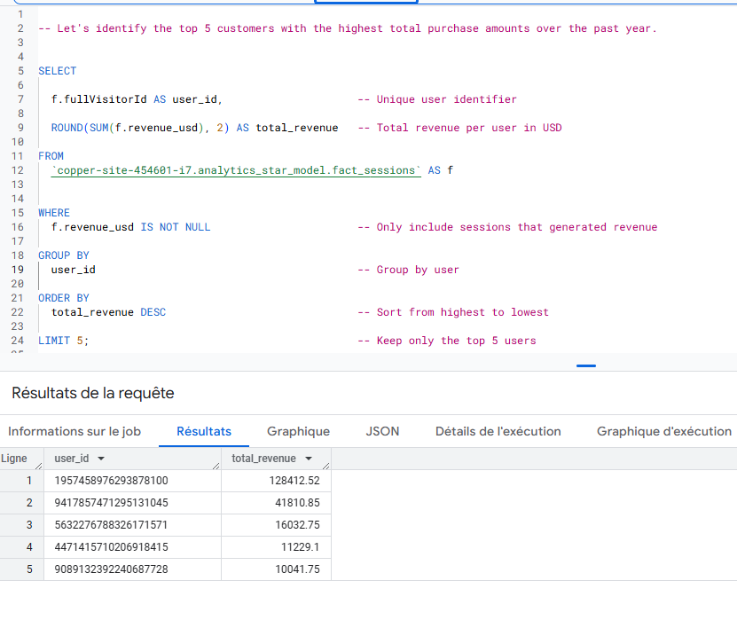
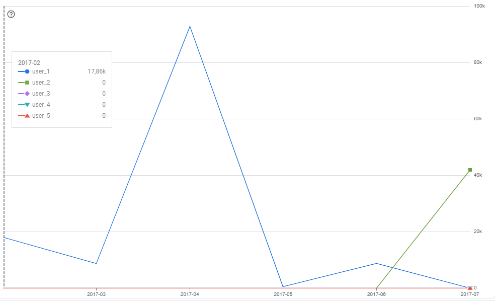
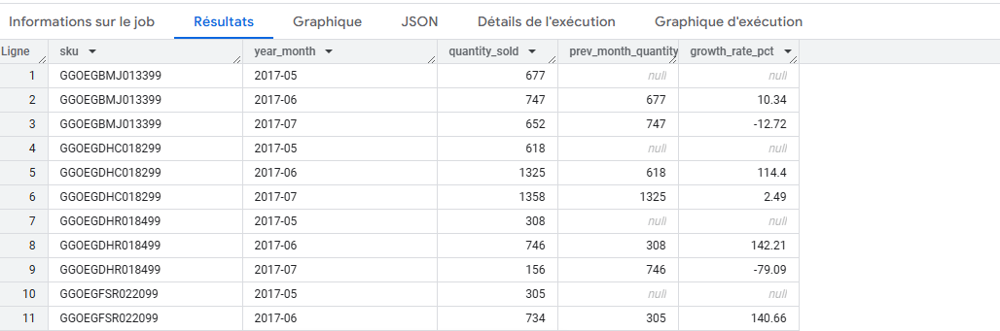
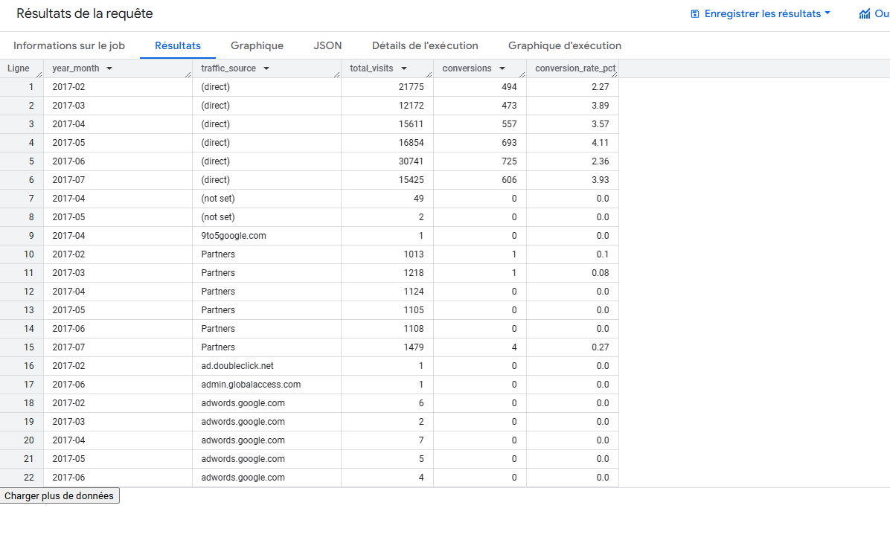
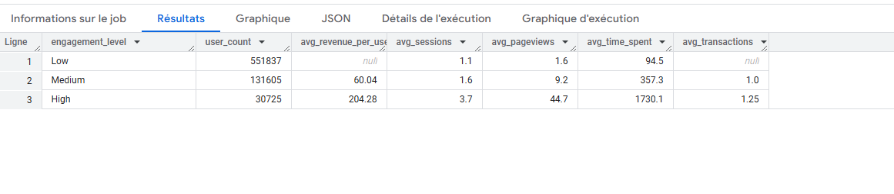
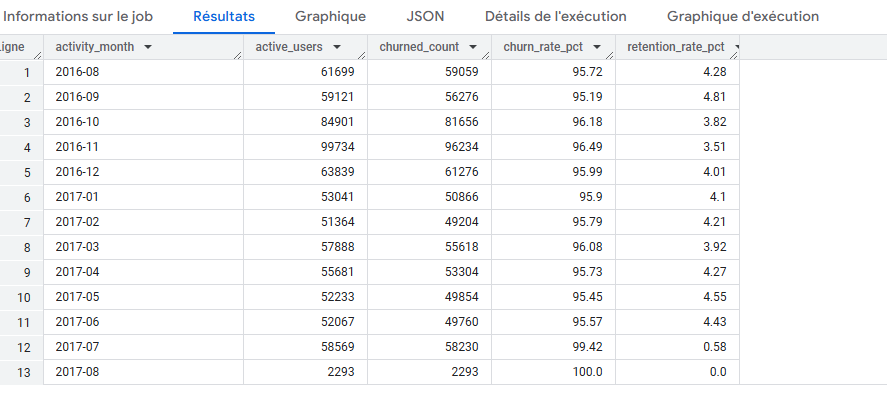

# Step 2 - Star Schema Modeling in BigQuery

## Objective

Design and implement a Star Schema data model in BigQuery using the dataset bigquery-public-data.google_analytics_sample to enable efficient querying and analytics.

---

## Dataset Used

- **Source**: `bigquery-public-data.google_analytics_sample.ga_sessions_*`
- **Date Range**: `20160801` → `20170801` (1 year of data)
- **Tables used**: `Daily partitioned tables from 20160801 to 20170801`
- **Destination Dataset**: `analytics_star_model`

---

## Star Schema Structure

To support analytical queries, we implemented a Star Schema structure, centralizing session-level metrics in a single fact table and linking it to various dimension tables.


#### Table Overview

| Table               | Type        | Description                                       |
|--------------------|-------------|---------------------------------------------------|
| `fact_sessions`     | Fact         | Session-level activity and revenue data           |
| `dim_user`          | Dimension    | Visitor information (type, browser, returning)    |
| `dim_device`        | Dimension    | Device category and operating system              |
| `dim_geo`           | Dimension    | Geolocation (country, region, city)               |
| `dim_traffic`       | Dimension    | Traffic sources, campaigns, and keywords          |
| `dim_date`          | Dimension    | Calendar-based attributes (year, month, quarter)  |
| `staging_sessions`  | Intermediate | Raw session data used for building the model      |


---

#### Key Advantages

- Simplifies complex queries through **dimensional modeling**
- Allows efficient **aggregation and filtering**
- Supports a wide range of business KPIs and analytical tasks
---


## Folder Structure

All SQL queries used to build the star schema are stored in the `star_schema_design/` folder:

```
analytics-queries/
└── star_schema_design/
    ├── dim_user_table_query.sql
    ├── dim_device_table_query.sql
    ├── dim_geo_table_query.sql
    ├── dim_traffic_table_query.sql
    ├── dim_date_table_query.sql
    ├── fact_sessions_query.sql
    ├── staging_session_table_query.sql
```

---

## Consolidated Table

A single table named staging_sessions was created by unifying daily session tables using wildcard queries:

CREATE OR REPLACE TABLE `analytics_star_model.staging_sessions` AS
SELECT *
FROM `bigquery-public-data.google_analytics_sample.ga_sessions_*`
WHERE _TABLE_SUFFIX BETWEEN '20160801' AND '20170801';


## How to Use

1. Open [BigQuery Console](https://console.cloud.google.com/bigquery)
2. Use your project and dataset (`analytics_star_model`)
3. Copy-paste each `.sql` script from the `star_schema_design/` folder
4. Execute queries in the following order:
   - `staging_session_table_query.sql`
   - All `dim_*` queries
   - `fact_sessions_query.sql`

---

## Note :

- All tables are partitioned by `date` or contain a `session_id` key.
- Foreign keys from the fact table link to dimension tables for easier analysis.


# Step 3 - Analytical Tasks: Answering Advanced Business Questions 

## 3.1. Customer Purchase Patterns

### Objective

Identify top-spending customers over the past year and analyze their monthly revenue contributions.

---

### Business Question

 Who are the top 5 users by total revenue over the past year, and what are their monthly purchasing patterns?

---

### Visual Output

The top 5 customers with the highest total purchase amounts over the past year




Monthly revenue trends for top 5 users (each as a separate column



---

### Insights & Interpretation

User 1

    - Consistent purchase activity across many months

    - Major spike in April 2017 (~$100K)

    - Represents a loyal, high-value customer

    - Good candidate for loyalty programs or targeted retention

User 2

    - Made one large purchase in July 2017 (~$41K)

    - No other recorded activity

    - Possibly a one-time high spender, bulk buyer, or data anomaly

Users 3–5

    -   Very low or inconsistent revenue

    - Contributed minimally compared to top 2 users


### Patterns & Observations

- No obvious **seasonality** across users
- Revenue spikes appear **user-specific**, not time-based
- **Anomalies** detected:
  - **User 2**’s spike might be fraud, anomaly, or promotion-based
  - **User 1** could be targeted for future marketing campaigns

---


### Source

- Table: `analytics_star_model.fact_sessions`
- Dimensions: `userId`, `date`
- Metrics: `totalTransactionRevenue`


## 3.2. Customer Purchase Patterns

### Objective

This analysis focuses on identifying the top 10 products with the highest sales volume during the last quarter (May to July 2017), using Google Analytics session data. Additionally, we compute their month-over-month (MoM) growth rates to identify significant fluctuations or seasonal patterns.


### Methodology


We used the BigQuery dataset staging_sessions and followed these steps: 

-   Identify total quantity sold per product per month during Q2 2017.

-   Select top 10 products based on total sales volume.

-   Compute monthly sales volume for each of these top 10 products.

-   Calculate MoM growth rates using LAG() and SAFE_DIVIDE() functions.


**Sample Results** 




**High Growth Products**

- GGOEGGOA017399 grew by +204.14% from May (894 units) to June (2719 units).

- GGOEGFSR022099 also showed a +140.66% MoM growth from May to June.

- These products are likely popular, benefitting from promotion or seasonal demand.

**Declining Sales**

- GGOEGHR018499: From 746 → 156 → -79.09% in July. May indicate market saturation or customer churn.

- GGOEGGOA017399 dropped by -99.93% from June (2719) to July (2). This huge drop could reflect stockout, seasonality, or anomaly.


**Stable Products**

- Some SKUs like GGOEGFYQ016599 maintained steady increases:

- May → June → July: (332 → 402 → 578), MoM growth of 21%, 43.78%.


**Insights**

- Extreme fluctuations (e.g., >100% growth or -99% drop) may signal:

- Inventory or fulfillment issues

- Temporary promotions or discounts

- Seasonal or one-off events

- Consistent growth = good candidate for long-term promotions

- Sudden drops = flag for further review (e.g., pricing, availability, competitor effect)


### Source

Table: analytics_star_model.staging_sessions

Fields used: productSKU, productQuantity, date, eCommerceAction.action_type = 6


## 3.3. Traffic Source Effectiveness:

### Objective

Analyze the effectiveness of different traffic sources in driving conversions by:
•	Calculating conversion rates for each traffic source.
•	Observing how these rates have evolved over the past 6 months.





**Top Performer** : (direct)

•   Appears consistently from Feb to Jul 2017

•   Highest conversion rates: 2.27% to 4.11%

•   Example: May 2017 – 693 conversions from 16,854 visits

-   Interpretation: Highly engaged traffic, likely returning users or direct access from bookmarks.


**Underperformers**: Partners

•   Conversion rates consistently low: 0.0% to 0.27%

-   Example: Jul 2017 – only 4 conversions out of 1,479 visits (0.27%)

•   Suggests low engagement or poor targeting

**Zero Conversions**:

•   Sources like 9to5google.com, adwords.google.com, admin.globalaccess.com had 0 conversions

Possible reasons:

    -   Very low volume (1–7 visits)

    -   Irrelevant or low-intent traffic

    -   Broken or missing conversion tracking


**Key Insights**


•   Direct traffic is the strongest channel — likely from loyal, returning users

•   not set traffic sources appear but lack proper tracking — should be fixed

•   Ad channels like adwords.google.com brought visits but no purchases — needs urgent review

•   Partners channel consistently underperforms — either due to traffic quality or post-click experience


**Source**

•   Table: analytics_star_model.staging_sessions

•   Fields used: date, trafficSource.source, fullVisitorId, eCommerceAction.action_type


## 3.4. User Engagement Segmentation

### Objective

Segment users based on their engagement levels (e.g., low, medium, high) and analyze the average revenue generated by each segment. Identify any correlations between user engagement and purchasing behavior.


**Dataset Used**

•   Source: analytics_star_model.fact_sessions

•   Time Period: Entire dataset (sessions with and without revenue)


Users were segmented into three engagement levels based on their activity:

| Engagement Level   | Criteria (per user) |          
|--------------------|---------------------|
| `Low`              | < 2 sessions        | 
| `Medium`           | 2–4 sessions        | 
| `High`             | > 4 sessions        |


Metrics calculated for each segment:

    •  Total number of users

    •  Average revenue per user

    •  Average number of sessions

    •  Average number of pageviews

    •  Average time spent (in seconds)

    •  Average number of transactions


**Results**




**Insights & Interpretation**

•   Low Engagement:

    -   The majority of users fall into this category.

    -   They show minimal interaction and generate no revenue.


•   Medium Engagement:

    -   Users in this group generate moderate revenue (~$60 per user).

    -   They are more active, with ~9 pageviews and ~1 transaction on average.


•   High Engagement:

    -   Smallest group in size but most profitable.

    -   They generate ~$204 per user with frequent transactions and high time spent.


**Key Takeaway**:

There is a strong positive correlation between user engagement and purchasing behavior.

Users who engage more (longer sessions, more pageviews) spend significantly more.


## 3.5.  Churn Rate Analysis

### Objective

Analyze user churn over the past year by calculating the monthly churn and retention rates. Identify trends in user engagement and propose hypotheses explaining changes in user retention.





**Note:** High churn rates suggest most users are not returning the next month. July and August 2017 show near-total churn, likely due to dataset limitations.


**Key Insights**

•   Churn rates are consistently above 95% month over month.

•   Retention is low, with only 4–6% of users returning the next month on average.

•   The sharp drop in July-August indicates possible dataset boundary or seasonal effect.


**Recommendations**

•   Investigate reasons for poor retention: UI/UX, marketing quality, product value, etc.

•   Run qualitative surveys to better understand user drop-off reasons.

•   Launch win-back campaigns or automate re-engagement flows (emails, push notifications).